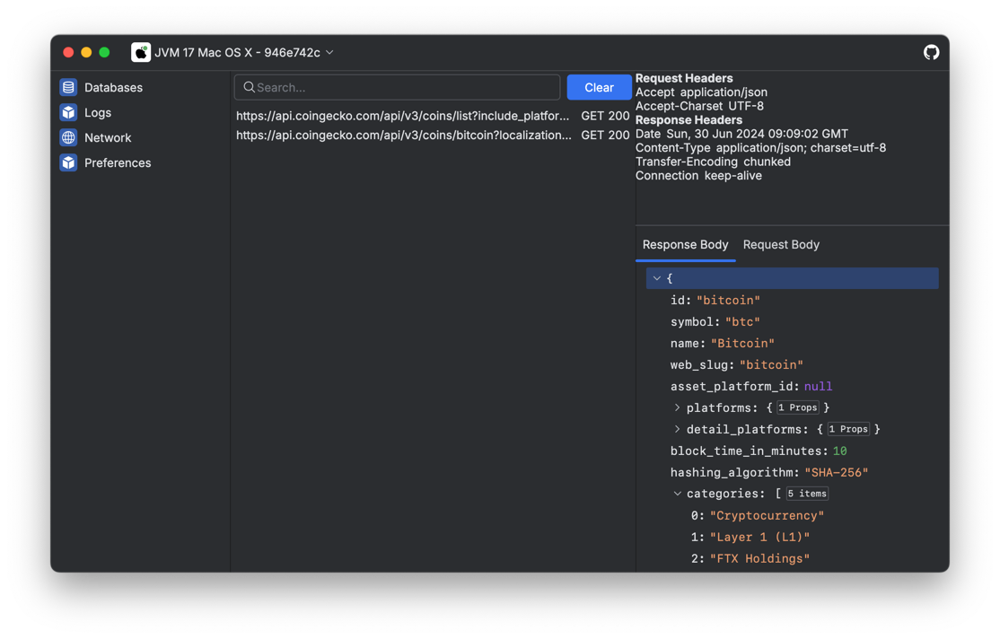

KMP Test Bench
===

A modular tool for debugging Kotlin Multiplatform applications.

## Features

### Desktop Application

Use the KMP-Test-Bench Desktop application to remotely inspect and control you project running in any environment.

### In-App UI

Embed developer controls in your application which with many of the same Desktop Application features,
without having to connect to the Desktop client.
The available controls can be easily extended with custom settings and plugins, making it the only debug
menu you need.

### Plugin System

KMP-Test-Bench is built on a robust plugin System enabling all core features like the network and database
inspectors to inject custom Desktop & In-App UI, observe application events, and sync data with minimal effort.

The Plugin Toolkit provides all the necessary components to create Plugins for libraries or project specific
functionality.

### Automated Installation

KMP-Test-Bench is applied via a Gradle plugin providing access to the Desktop Application
without installation and convenient creation of custom plugins.