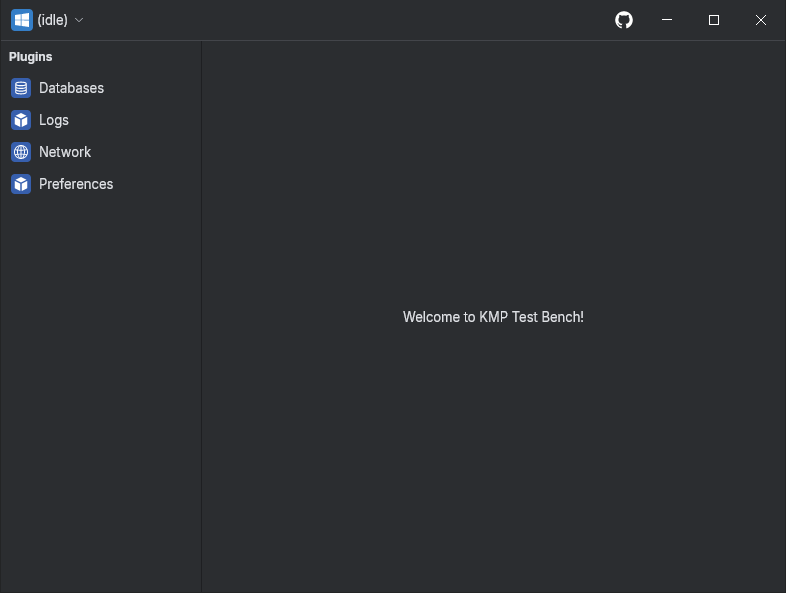

# Getting Started

## Installation

Include the Desktop application plugin in your root `build.gradle.kts`:

### Configure Gradle Plugin

```kotlin
plugins {
  id("org.drewcarlson.testbench") version "{{ lib_version }}"
}
```

Optional plugin configuration:
```kotlin
testbench {
  // ...
}
```

### Configure Runtime Client

Add the client and plugins to your `build.gradle.kts`:
```kotlin
dependencies {
  implementation(TestbenchDeps.clientCore)
  implementation(TestbenchDeps.clientNetworkKtor)
}
```


```kotlin
val client = TestbenchClient(
  plugins = listOf(MyPlugin())
)
```

## Run Testbench

Launch the desktop app with the `runTestbench` task.

```bash
./gradlew runTestbench
```

You should see an idle testbench window:


