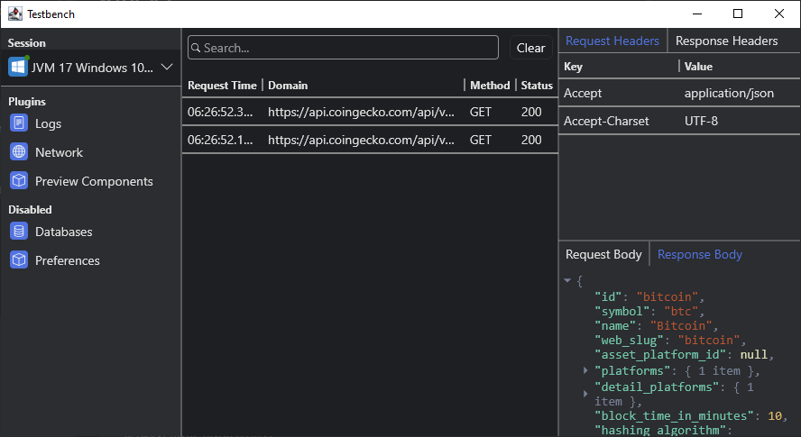

# Network Plugin



The network plugin allows you to capture and explore the network traffic in your project.
It supports popular KMP networking libraries and is easily extended with support for custom HTTP clients.


## Ktor v3

Monitor [Ktor](https://ktor.io/) v3 client requests:

Add dependency:

```kotlin
dependencies {
  implementation(TestbenchDeps.networkClientKtor)

  // or manually
  implementation("org.drewcarlson.testbench:network-client-ktor:{{ lib_version }}")
}
```

Configure the plugin:

```kotlin
// Set up the testbench plugin
val networkPlugin = KtorNetworkClientPlugin()

// Add it to the testbench client
val testbenchClient =
  TestbenchClient(
    plugins = listOf(networkPlugin),
  )

// Install the Ktor Plugin
val httpClient = HttpClient {
  networkPlugin.install(this)
}
```

## OkHttp

Monitor [OkHttp](https://github.com/square/okhttp/) requests:

Add dependency:

```kotlin
dependencies {
  implementation(TestbenchDeps.networkClientOkhttp)

  // or manually
  implementation("org.drewcarlson.testbench:network-client-okhttp:{{ lib_version }}")
}
```

Configure the plugin:

```kotlin
// Set up the testbench plugin
val networkPlugin = OkHttpNetworkClientPlugin()

// Add it to the testbench client
val testbenchClient =
  TestbenchClient(
    plugins = listOf(networkPlugin),
  )

// Install the OkHttp interceptor
val okhttp = OkHttpClient.Builder()
  .addInterceptor(networkPlugin)
  .build()
```

## Custom HTTP Client

Add dependency on the core plugin library:

```kotlin
dependencies {
  implementation(TestbenchDeps.networkClientCore)

  // or manually
  implementation("org.drewcarlson.testbench:network-client-core:{{ lib_version }}")
}
```

Implement a `NetworkPlugin` using your HTTP clients middleware or logging APIs:

```kotlin
class CustomNetworkClientPlugin :
    NetworkPlugin(),
    ClientPlugin<Unit, NetworkPluginMessage> {

  private val messageQueue = Channel<NetworkPluginMessage>(
    capacity = Int.MAX_VALUE,
    onBufferOverflow = BufferOverflow.DROP_OLDEST,
  )

  override val outgoingMessages: Flow<NetworkPluginMessage> = messageQueue.receiveAsFlow()

  override suspend fun handleMessage(message: Unit) = Unit

  suspend fun sendMessage(message: NetworkPluginMessage) {
    messageQueue.emit(message)
  }
}

val networkPlugin = CustomNetworkClientPlugin()

val customHttpClient = HttpClientBuilder()
  // Send update for a new request that is starting
  .onRequest { request ->
    // Add ID to track response updates
    request.attribute["debug-id"] = uuid()
    val message = NetworkRequestMessage(
      id = request.attribute["debug-id"],
      url = request.urlString,
      method = request.method,
      headers = request.headers,
      initiatedAt = request.startedAt,
      body = request.bodyTextOrNull(),
    )
    networkPlugin.sendMessage(message)
  }
  .onResponse { response ->
    // Send update for completed response
    NetworkResponseMessage.Completed(
      id = response.attributes["debug-id"],
      headers = response.headers,
      status = response.status,
      body = response.bodyAsText(),
    )
    messageQueue.trySend(message)
  }
  .onError { error ->
    val message = when (error) {
      // Send update for cancelled request
      is RequestCancelled ->
        NetworkResponseMessage.Cancelled(
          id = error.request.attributes["debug-id"],
          sent = true, // Set if the request was actually initiated
        )
      // Send update for a failed request
      else ->
        NetworkResponseMessage.Failed(
          id = id,
          message = error.stackTraceToString(),
        )
    }
    messageQueue.trySend(message)
  }
  .build()
```
